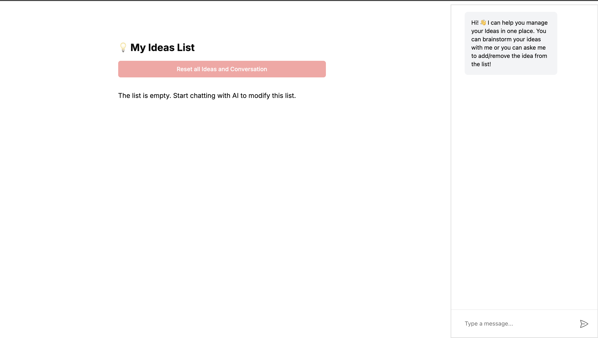

# Brainstorming Chatbot Application

This is a full-stack web application built with **Next.js** and **CopilotKit** library that allows users to brainstorm with a chatbot and save ideas generated during the conversation. Users can interact with the chatbot, save certain ideas to a list, and reset both the chat and saved ideas. All saved ideas is stored locally in the browser using **localStorage**.

## Live demo

You can also use/interact with the app on this URL: https://full-stack-assignment-202410.vercel.app

## Features:

- Chat interface for brainstorming ideas with a chatbot.
- Ability to save ideas from the chat to a local list.
- Reset button to clear the chat history and saved ideas.
- Uses **localStorage** for persistence of ideas.

## Prerequisites

Before running the application, ensure you have the following installed:

- Node.js (v16 or higher)
- NPM (v6 or higher) or Yarn

## Installation

1. Clone the repository:

   ```bash
   git clone https://github.com/codingfarhan/full-stack-assignment-202410
   cd brainstorming-chatbot
   ```

2. Install dependencies:

```bash
npm install
```

## (Optional Step: Adding your own API key)

The app already comes with its own API key in **.env** file, but if you want to include your own API key then you can get it from here: https://cloud.copilotkit.ai/dashboard.

3. Create a .env.local file (optional, if you ):

```bash
touch .env
```

THen add the environemnt variable NEXT_PUBLIC_COPILOT_CLOUD_PUBLIC_API_KEY to this file:

```bash
NEXT_PUBLIC_COPILOT_CLOUD_PUBLIC_API_KEY=your_openai_api_key
```

## Run the server

4. Start the development server:

```bash
npm run start
```

5. Open the app in your browser:

```bash
http://localhost:3000
```

## Usage

1. Enter a message in the chat interface to interact with the chatbot. You can brainstorm different ideas or ask the AI to generate an idea for you.

<p align="center">
  
</p>

2. Once you think you have an idea that you like, simply ask the AI to add that idea to the list and it will do it for you. You can view the saved idea on the left side of screen.

<p align="center">
  
</p>

3. Similarly, you can also ask the AI to remove any/all ideas from the list and it'll do that.

4. You can also ask the AI to mark any idea as 'Completed', and you'll notice a 'tick' appear on that idea.

<p align="center">
  
</p>

5. Use the "Reset" button to clear the chat history and saved ideas. It will go back to its originate state.

<p align="center">
  
</p>

## Known Issues

-> Since the app uses localStorage, the saved ideas will only persist for the current browser and device.
-> The chatbot might respond slowly if the OpenAI API key is invalid or if the API rate limit is reached.
-> The app is not optimized for mobile devices.

## Future Improvements

-> Add user authentication to store ideas on a database for cross-device access.
-> Enhance the chatbot’s customization and extend functionality for broader use cases.
